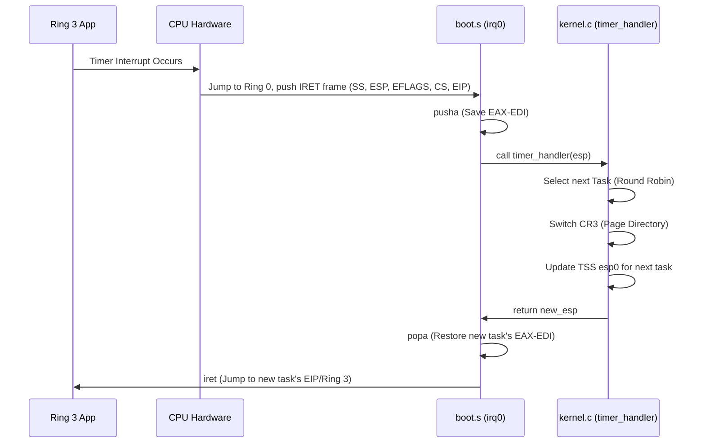

# sOS Technical Details & Architecture

This document serves as an exhaustive guide to the inner workings of sOS. If you wish to understand how sOS handles memory, processes, or the filesystem, you are in the right place.

## 1. Boot Process

sOS relies on the **Multiboot 1** specification. 
1. The bootloader (GRUB) loads the kernel into memory at `1MB` (`0x100000`).
2. Execution begins in `boot.s` at `_start`.
3. Assembly code sets up a rudimentary 16 KiB stack (`stack_bottom` to `stack_top`).
4. Multiboot magic numbers and information structures are pushed onto the stack.
5. Execution is passed to the C environment via `call kernel_main`.

## 2. Memory Management

Memory management in sOS is divided into three abstraction layers:

### A. Physical Memory Manager (PMM)
The PMM manages the raw RAM available on the machine. It divides memory into 4 KB chunks (Pages) and uses a **Bitmap** (`pmm_bitmap`) to track free/used pages.
* `1` = Page Used, `0` = Page Free.
* The first 2 MB are reserved immediately to protect the kernel and memory-mapped hardware (like VGA memory).

### B. Virtual Memory Manager (Paging)
Paging is enabled via the `CR3` and `CR0` registers. 
* **Kernel Page Directory:** Maps the first 16 MB of physical memory to the first 16 MB of virtual memory (Identity Mapping) as Supervisor (Ring 0) pages.
* **User Page Directories:** When a new Ring 3 task is created, a copy of the Kernel Page Directory is made. The user application's code is mapped at `0x8000000` (128 MB) and its stack at `0x7FF0000`.

### C. Kernel Heap Allocator (`kmalloc` / `kfree`)
sOS implements a custom linked-list block allocator for kernel dynamic memory.
* To prevent buffer overflows and heap corruption, every block includes a magic signature (`0xDEADBEEF`).
* If `kfree` or `kmalloc` encounters a block with a broken magic number, it instantly triggers a Kernel Panic to protect system integrity.

## 3. Privilege Rings & Interrupts (GDT / IDT)

### Global Descriptor Table (GDT)
sOS sets up a Flat Memory Model using 6 segments:
1. `Null` (Mandatory)
2. `Ring 0 Code`
3. `Ring 0 Data`
4. `Ring 3 Code`
5. `Ring 3 Data`
6. `TSS` (Task State Segment)

The **TSS** is strictly used for hardware context switching. When an interrupt occurs while running Ring 3 code, the CPU needs a secure Ring 0 stack to push the context to. The TSS provides the address of this kernel stack (`esp0`).

### Interrupt Descriptor Table (IDT)
The IDT handles CPU exceptions (Divide by Zero, Page Fault, etc.) and hardware IRQs.
* `IRQ0` (Timer) is mapped to `int 32`.
* `IRQ1` (Keyboard) is mapped to `int 33`.
* `Syscalls` are mapped to `int 0x80` (128) with a DPL (Descriptor Privilege Level) of 3, meaning user-space can invoke it.

## 4. Preemptive Multitasking

sOS uses the PIT (Programmable Interval Timer) set to 100 Hz (10 ms per tick). 
Every 10ms, `IRQ0` fires:

The system supports up to 8 parallel tasks. Task `0` is always the Shell.

## 5. Ring 3 Application Loading (ELF)

When the user types `run app.sos`:
1. The kernel reads the ELF file from the FAT16 disk.
2. It verifies the ELF Magic Number (`0x7F 'E' 'L' 'F'`).
3. It allocates a new Page Directory and a physical page for the user stack.
4. It iterates over the ELF Program Headers (`PT_LOAD` segments).
5. It temporarily loads the new Page Directory into `CR3` and copies the `.text`, `.data`, and `.rodata` sections directly into the virtual address `0x8000000`. It zero-fills the `.bss` section.
6. A fake `IRET` frame is pushed onto the new task's kernel stack, pointing `EIP` to the ELF entry point (`e_entry`).
7. The task state is set to `READY`, and the PIT scheduler will naturally switch to it.

## 6. Filesystem (FAT16) & Storage

sOS uses an entirely custom ATA PIO polling driver to read/write 512-byte sectors from the hard drive (Ports `0x1F0` - `0x1F7`).

### The Permission System Hack
FAT16 does not natively support UNIX-like UIDs or permissions. To implement a multi-user environment, sOS hacks the standard FAT16 directory entry structure:

Standard FAT16 Entry (32 bytes):
* `0x0B`: Attributes (Read Only, Hidden, System, Volume, Directory, Archive)
* `0x0C`: Reserved (Usually for Windows NT VFAT)

sOS repurposes the `0x0C` (Reserved) byte to act as the **Security Byte** (`sec_byte`):
* `Bits 0-3`: Owner UID (0 to 15).
* `Bit 4`: Read permission for Owner.
* `Bit 5`: Write permission for Owner.
* `Bit 6`: Read permission for Others.
* `Bit 7`: Write permission for Others.

When `cat` or `write` is called, the OS verifies `current_uid` against these bits before proceeding with cluster traversal.

## 7. Syscall Application Binary Interface (ABI)

To interact with the OS, User Applications trigger `int 0x80`. Parameters are passed via registers (Linux-style):
* `EAX`: Syscall Number
* `EBX`: Argument 1
* `ECX`: Argument 2
* `EDX`: Argument 3

**List of Syscalls:**
* `1`: `write(fd, buffer, size)`
* `2`: `exit()` - Kills the current task and frees its memory.
* `3`: `sbrk(increment)` - Extends the heap boundary (`prog_break`) by allocating new physical pages dynamically.
* `4`: `read(fd, buffer, size)`
* `5`: `uptime()`
* `6`: `read_file(filename, buffer, out_size)`
* `7`: `write_file(filename, text)`

*Security Note:* The syscall handler runs extensive bounds-checking (`is_valid_user_range`) to ensure a Ring 3 application does not pass a pointer pointing to Kernel memory (e.g., trying to read `/passwd` by tricking the kernel into doing it for them).